# Release Notes - eCSB Beta 4.0

## Dodane funkcjonalności biznesowe
- Rejestracja przez maila - dodano zakładanie konta w systemie poprzez potwierdzania rejestracji na podanego maila

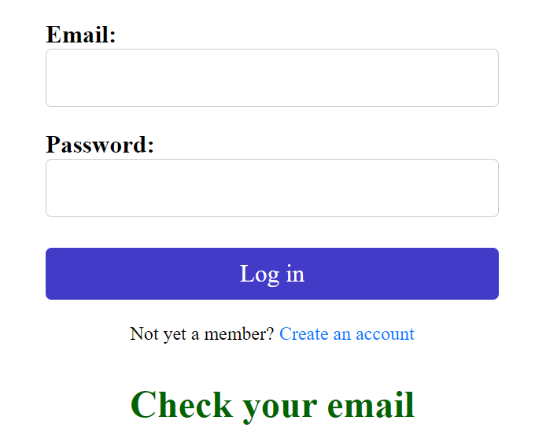

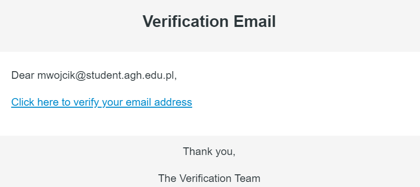

- Domyślne zasoby do tworzenia gry - administrator w przypadku braku dostępnych zasobów może skorzystać z domyślnych przy tworzeniu sesji gry

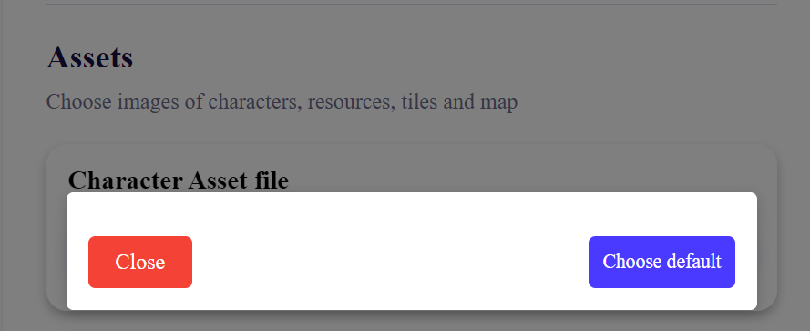

- Zaciąganie przeszłej konfiguracji przy tworzeniu nowej gry - przy tworzeniu nowej sesji gry można wczytać ustawienia dowolnej przeszłej sesji gry (skrócenie czasu tworzenia rozgrywki o 90%)
  
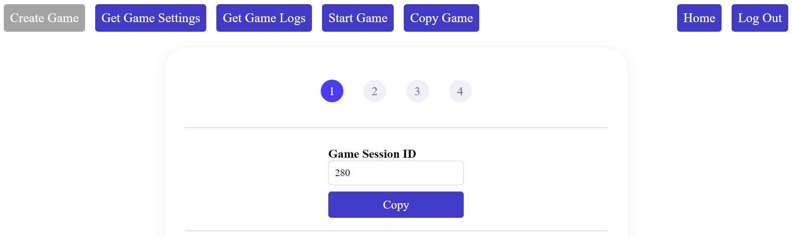
  
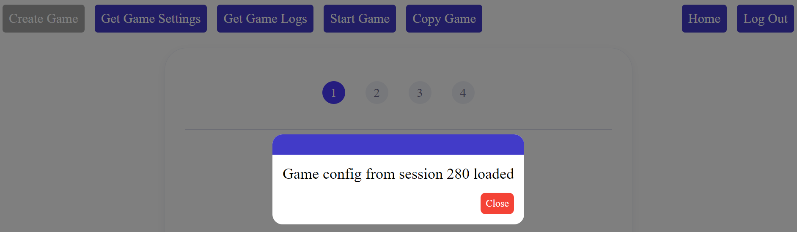

- Podgląd wgranych zasobów - szybsza weryfikacja poprawności wgranych zasobów
  
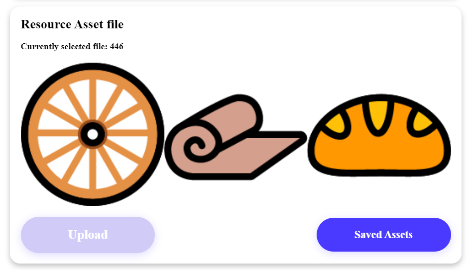

- Walidacja tworzenia gry - każda strona formularza tworzenia gry jest osobno walidowana, by nie dochodziło do błędów przy końcowym wysyłaniu żądania

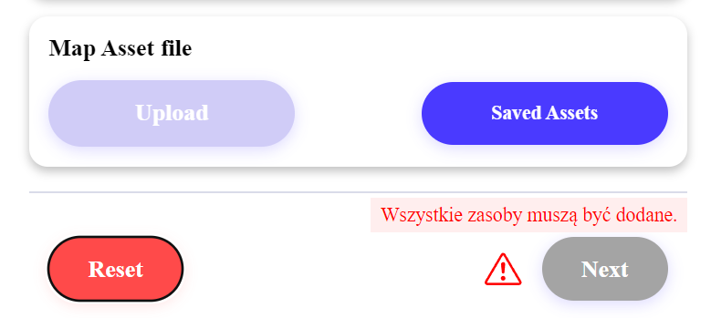

- Sugestie podczas handlu oraz kooperacji - możliwość poinformowania drugiej strony interakcji o swoim stanie ekwipunku/oczekiwaniach
  
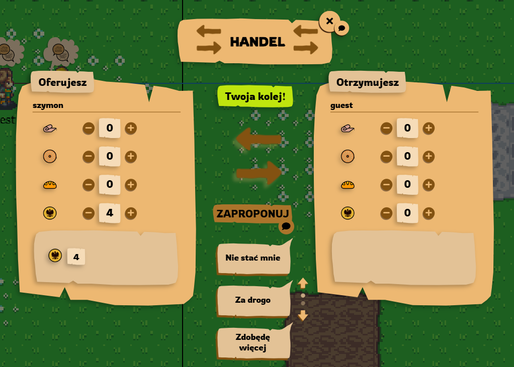
  
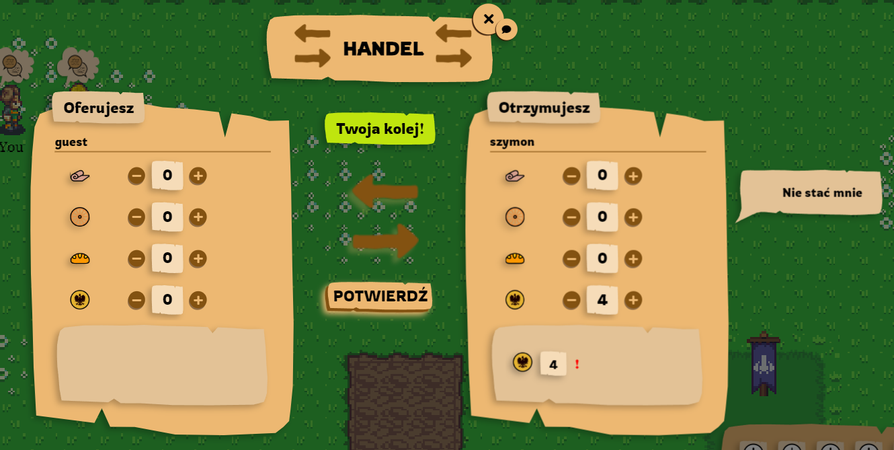

- Ponaglanie drugiej strony w handlu i kooperacji - możliwość ponaglenia drugiej strony interakcji, aby szybciej skończyła swoją turę
  
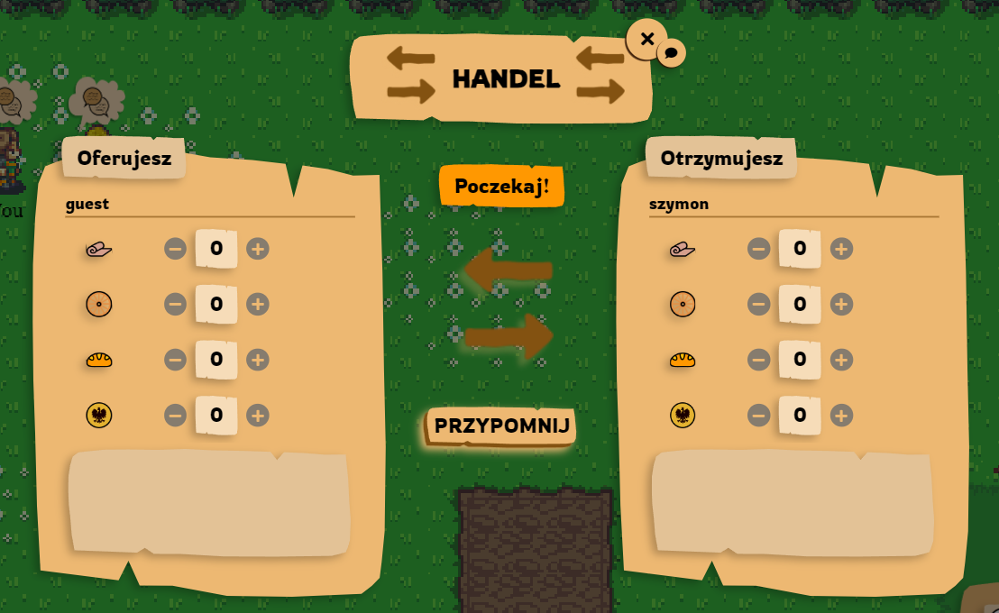

- Poprawienie logiki tokenów czasu - tokeny odnawiają się niezależnie i po kolei

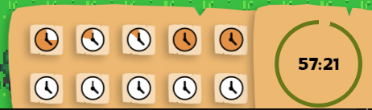

## Dodane funkcjonalności techniczne
- Podbicie wersji bibliotek - zaktualizowanie wersji frameworka KTOR oraz biblioteki od WebSocketów
- Dopracowanie obsługi zerwania połączenia - zastosowanie algorytmu Backoff oraz ponawiania połączenia przy ewentualnym zerwaniu
- Obsługa użytkowników bez roli - odpowiednie informowania użytkownika, jeśli jego akcje nie uzyskały autoryzacji serwera
- Zmiana algorytmu wyszukiwania ścieżki - zmiana z Bidirectional BFS na JPS
- Pozbycie się endpointów typu REST z modułu chat - wysyłanie ekwipunku w wiadomości WebSocket zamiast żądania typu REST
- Przeniesienie logiki lobby do modułu game-init - przeniesienie logiki odpowiedzialnej za dołączenie gracza do gry do modułu odpowiedzialnego za tworzenie gry (game-init) 
